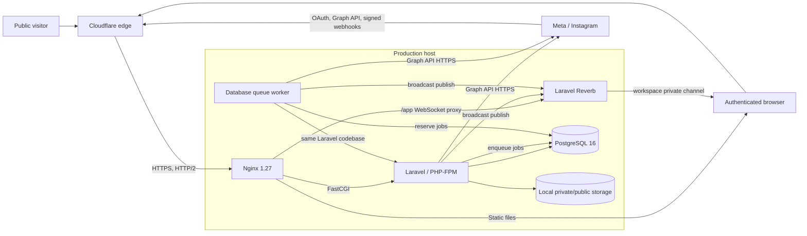
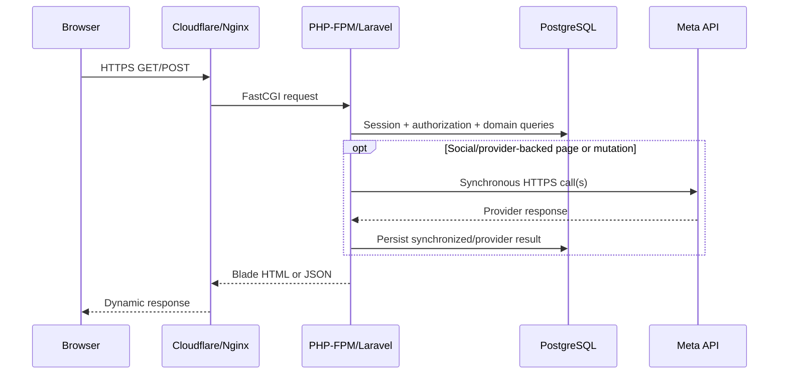
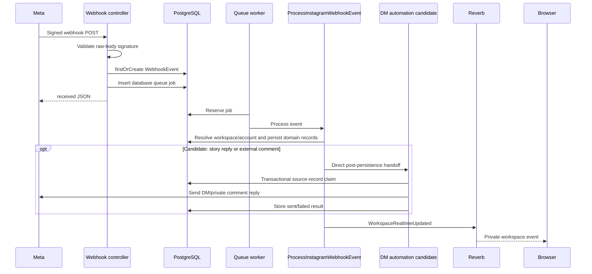
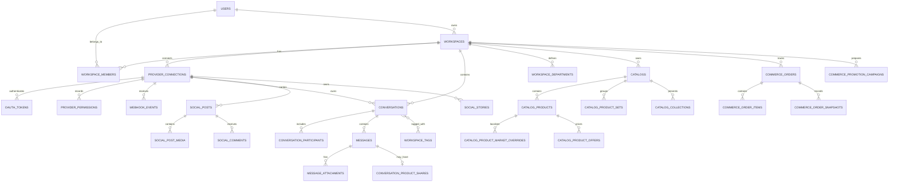
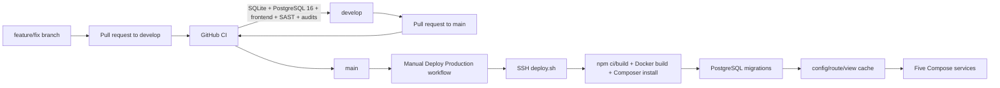

# Performance architecture map

Last verified: 24 September 2026.

This document is the handoff map for a separate performance investigation. It
describes the current system, request/data flows, deployment topology, known
workload amplifiers, and the measurements needed before optimizing. It does not
claim that every pressure candidate is a proven bottleneck.

## Snapshot boundaries

| Scope | Evidence | Status |
| --- | --- | --- |
| Current source candidate | Branch `feature/story-comment-auto-dm`, base revision `b198429ec473d7020146dd482e265bd4808d6c3e`, plus the uncommitted Instagram DM automation change | Includes the latest local feature; not deployed |
| Last verified production release | Branch `main`, revision `df7a0d266d0b97510071587adf8c69d31915a51a` | Verified 23 September 2026 |
| Public edge observation | `https://mini.leadochat.com`, sampled from the Mac mini on 24 September 2026 | Live public-only observation; not an authenticated benchmark |
| Production topology | `docker-compose.prod.yml` plus the last verified operations record | Five services: app, Nginx, PostgreSQL, queue, and Reverb |

The source candidate has 134 registered routes. The production revision does not
yet include the new `settings.automation.instagram.update` route or automatic
story/comment DM behavior. Reverify the exact production SHA before any profiling
or deployment decision.

## 1. System context

LeadoChat Mini is a modular monolith. `app`, `queue`, and `reverb` are separate
processes but use the same Laravel code and mounted `src` directory. There is no
application microservice boundary, Redis service, separate search engine, object
storage runtime, CDN upload pipeline, or Laravel Octane process in the current
production Compose topology.

## 2. Runtime topology and state ownership

| Component | Current responsibility | Persistent or shared state | Performance relevance |
| --- | --- | --- | --- |
| Cloudflare | Public TLS/edge, HTTP/2 and HTTP/3 advertisement, public asset caching | Edge cache and network metadata | Public HTML currently remains dynamic; hashed assets receive a four-hour edge cache policy in the live sample |
| Nginx | HTTP to HTTPS redirect, static delivery, FastCGI routing, `/app` WebSocket proxy, response headers | Mounted source/public files and TLS material | No origin gzip/Brotli, explicit immutable asset rule, microcache, or FastCGI cache is defined in the repository config |
| `app` | Browser requests, authentication, Blade rendering, provider calls, Artisan | PostgreSQL plus local storage | PHP-FPM tuning and OPcache configuration are not defined in the repository and must be checked live |
| `queue` | One `queue:work database` process for the `default` queue | `jobs`, `job_batches`, `failed_jobs` in PostgreSQL | One first-party queued job exists: `ProcessInstagramWebhookEvent`; worker timeout is 120 seconds while database `retry_after` defaults to 90 seconds |
| `reverb` | Workspace WebSocket connections and broadcasts | In-process connection state | Single instance; scaling defaults off and no Redis service exists in the topology |
| `postgres` | Domain data, sessions, cache, queue, locks, and failed-job records | Named Docker volume | Web traffic, polling, queue activity, cache traffic, and sessions share one database server |
| Local filesystem | Private message attachments, public assets, Laravel logs, compiled views | Host-mounted `src` tree | Authenticated/private attachment delivery can pass through PHP; default uploads are not offloaded to object storage |
| Meta endpoints | OAuth, Instagram Graph, Facebook Graph commerce, media, messaging, insights | Provider-owned | Many calls run synchronously in browser requests; a subset has explicit timeouts |

Production caches Laravel configuration, routes, and views after deployment. The
code is bind-mounted into containers rather than copied into an immutable release
image. Composer installation, migrations, and cache generation happen in place.

## 3. Source inventory

The current candidate contains:

| Surface | Count or size |
| --- | ---: |
| Registered routes | 134 |
| Route methods | 55 `POST`, 54 `GET` plus `HEAD`, 13 `DELETE`, 11 `PATCH`, 2 `PUT` |
| First-party controller files | 27 |
| Eloquent model files | 28 |
| Provider/application service files | 19 |
| First-party queued job classes | 1 |
| First-party broadcast event classes | 1 |
| Migration files | 45 |
| Tables created by migrations | 40 |
| Blade views | 55 |
| First-party JavaScript files | 4 |
| PHPUnit test files | 41 |
| Current full suite | 144 tests, 1,149 assertions |

Largest execution and rendering files:

| File | Lines | Main responsibility |
| --- | ---: | --- |
| `resources/views/inbox/index.blade.php` | 5,517 | Inbox markup, styles, composer, uploads, reactions, product picker, polling, and Reverb handling |
| `resources/views/settings/index.blade.php` | 5,070 | All settings sections and most section-specific UI behavior |
| `resources/views/social/instagram/index.blade.php` | 4,372 | Posts, comments, stories, publishing, polling, dialogs, and Reverb handling |
| `app/Http/Controllers/SocialController.php` | 2,041 | Social reads, provider synchronization, publishing, moderation, and local persistence |
| `app/Http/Controllers/InboxController.php` | 1,803 | Inbox reads, sends, uploads, state changes, and realtime snapshots |
| `app/Jobs/ProcessInstagramWebhookEvent.php` | 1,655 | Webhook normalization, identity resolution, persistence, sync enrichment, and broadcasts |
| `app/Services/Meta/Commerce/MetaCommerceDiagnosticsService.php` | 1,002 | Provider diagnostics plus local readiness aggregation |

These sizes are architecture signals, not proof of runtime cost. They identify
places where query count, provider calls, serialization, HTML generation, and
change risk should be measured first.

## 4. Application module map

| Module | HTTP/UI entry points | Main code owners | Data and external boundaries |
| --- | --- | --- | --- |
| Public web | `/`, features, product landing pages, pricing, legal, contact | `PublicPageController`, public Blade components | Server-rendered HTML and static assets; no first-party response cache was found |
| Authentication | Login, registration, verification, reset, profile | Breeze auth controllers, `ProfileController`, `User` | Database sessions, users, password tokens, mail driver |
| Workspace settings | `/settings` and 43 settings-prefixed routes | `WorkspaceSettingsController`, catalog/commerce controllers | Workspace-scoped tables; some sections build large nested graphs |
| Inbox | 17 inbox-prefixed routes | `InboxController`, `InstagramMessagingService`, `InstagramService` | Conversations/messages/attachments, synchronous provider sends, broadcasts |
| Social | 16 social-prefixed routes | `SocialController`, Instagram provider services | Local social tables plus synchronous Instagram fetch/publish/moderation calls |
| OAuth/channel | `/connections`, `/connect/instagram*` | `ConnectionController`, `InstagramConnectController`, token/login/subscription services | Encrypted tokens, requested permissions, Instagram OAuth and subscriptions |
| Webhooks | `/webhooks/meta/instagram` | `InstagramWebhookController`, `ProcessInstagramWebhookEvent` | Signature validation, durable event record, database queue, provider enrichment |
| DM automation candidate | `/settings/automation/instagram/{connection}` plus persisted webhook events | `InstagramDmAutomationService` | Per-connection JSON config; story reply and native comment-private-reply sends |
| Realtime | `/broadcasting/auth`, `/app`, private workspace channel | `WorkspaceRealtimeUpdated`, Reverb, inline Blade handlers | WebSocket event plus polling fallback; database remains source of truth |
| Commerce/App Review | Settings commerce routes | `WorkspaceMeta*Controller` and `Meta/Commerce` services | Local catalogs/orders/campaigns and optional Facebook Graph calls |
| Admin | Filament `/admin` routes | Filament panel | Uses the same application/database runtime |

### Authorization boundary

Authenticated product routes use `auth`, email verification, and
`workspace.access`. Workspace-management operations additionally use
`workspace.manage`. Controllers must still constrain route-bound records to the
current workspace. `workspaces.owner_id` is authoritative owner evidence.

## 5. Main request and event flows

### Server-rendered browser request

### Inbox read path

`InboxController::index` selects every matching conversation for the workspace and
eager-loads participants, all messages, message attachments, product shares,
senders, reply targets, tags, departments, and assigned agents. It then counts
unread inbound messages in PHP. It separately loads all active workspace tags,
departments, members, and active catalog products. No pagination method is used.

The selected page renders through the 5,517-line Inbox Blade view. Every three
seconds, each open Inbox tab calls `inbox.realtime.snapshot`. A changed snapshot or
workspace event triggers a new full-page HTML request; JavaScript parses that HTML
and swaps the message stack and conversation list.

### Social read path

`SocialController::buildInstagramPageData` loads connected accounts and performs
three count queries per account for post/comment/story tabs. It also runs global
count queries and may load up to 100 product-tag candidates.

The posts page synchronously calls `syncMediaFeed`, loads all local posts, loops
over every post and synchronously calls `syncMediaComments`, then reloads posts
with media and nested comments. The stories page synchronously fetches provider
stories and loads all local stories; engagement calculation reads up to 500 recent
inbound messages and filters story IDs in PHP. The comments page also builds its
data during the browser request.

While the posts tab is open, a 15-second timer calls
`social.instagram.realtime.posts`; that endpoint calls `syncMediaFeed` before
returning counters. A social Reverb event schedules a full Social page fetch and
DOM replacement.

### Message send path

Most Inbox sends are synchronous:

1. validate workspace/conversation/input;
2. call the Instagram messaging boundary during the HTTP request;
3. persist outbound status, attachment/product metadata, and conversation summary;
4. broadcast `WorkspaceRealtimeUpdated`;
5. return HTML redirect or JSON.

Provider latency therefore contributes directly to browser latency for messages,
attachments, voice messages, reactions, product cards, publishing, and moderation.

### Webhook and automation path

The webhook handler returns after durable event/job insertion; normalization and
most enrichment happen in the database worker. The DM automation handoff runs
inside that queue job after persistence. An automatic provider send can therefore
extend job duration, but its failure is caught and does not reopen the stored
webhook event.

## 6. Data architecture

### Data domains

| Domain | Tables |
| --- | --- |
| Identity/runtime | `users`, `password_reset_tokens`, `sessions`, `cache`, `cache_locks`, `jobs`, `job_batches`, `failed_jobs` |
| Workspace | `workspaces`, `workspace_members`, `workspace_departments`, `workspace_tags`, `workspace_audit_events` |
| Provider/webhook | `provider_connections`, `oauth_tokens`, `provider_permissions`, `webhook_events` |
| Inbox | `conversations`, `conversation_participants`, `messages`, `message_attachments`, `conversation_workspace_tag`, `conversation_product_shares` |
| Social | `social_posts`, `social_post_media`, `social_comments`, `social_stories` |
| Catalog/commerce | `catalogs`, `catalog_products`, `catalog_product_market_overrides`, `catalog_product_offers`, `catalog_product_sets`, `catalog_product_set_items`, `catalog_collections`, `catalog_collection_product_set`, `commerce_orders`, `commerce_order_items`, `commerce_order_snapshots`, `commerce_promotion_campaigns` |

Provider payloads and flexible state are stored heavily in PostgreSQL `JSONB`
columns, including connection metadata, webhook headers/payloads, conversation and
message metadata, social raw payloads, catalog metadata, and audit metadata. OAuth
tokens use encrypted model casts.

Important existing relational indexes include workspace/provider lookups,
conversation provider and last-message lookups, conversation/message creation and
status lookups, provider message IDs, provider social IDs, comment post/time,
story/post connection/time, catalog status, and queue/session/cache framework
indexes. There is no evidence in the repository of a `GIN` index over JSONB.

The source scan found no first-party use of Laravel `Cache` helpers and no
`paginate`, `simplePaginate`, or `cursorPaginate` calls in application code. The
database cache table exists, but domain/page result caching is not currently part
of the application architecture.

## 7. Frontend and realtime delivery

The frontend is server-rendered Blade with Alpine.js, Axios, Laravel Echo, and
Pusher protocol support bundled by Vite. The current local production build has
one application JavaScript asset of about 167 KB and one CSS asset of about 47 KB
before transfer compression.

The public layout additionally loads Bootstrap, animation CSS, LineIcons CSS/font,
and `wow.min.js` from local static files. Public CSS files total roughly 243 KB
uncompressed; the browser normally selects the 63 KB LineIcons WOFF2 rather than
all bundled font formats.

Large authenticated pages keep most page-specific CSS and JavaScript inline:

| Blade view | Source bytes | Inline style blocks | Inline script blocks |
| --- | ---: | ---: | ---: |
| Inbox | 230,750 | 1 | 9 |
| Settings | 331,069 | 9 | 2 |
| Social | 233,319 | 1 | 3 |

This means page-specific code is generated and transferred with HTML instead of
being independently hashed, cached, code-split, or loaded only when a section is
needed.

Realtime is hybrid:

- Reverb publishes `workspace.updated` on private `workspace.{id}` channels.
- Inbox still polls a snapshot endpoint every three seconds even while WebSocket
  connectivity exists.
- Inbox events or snapshot differences fetch the full current page and replace
  two HTML fragments.
- Social post counters poll every 15 seconds and invoke provider feed sync.
- Social workspace events fetch and parse the full Social page.

## 8. External provider boundaries

| Provider family | Uses |
| --- | --- |
| `www.instagram.com` / `api.instagram.com` | Authorization and short-lived token exchange |
| `graph.instagram.com` | Identity, long-lived token, media, stories, comments, messages, insights, profiles, subscriptions |
| `graph.facebook.com` | Deferred/separate commerce discovery, catalogs, product sets, collections |

Explicit request timeouts exist for Insights (10 seconds), media/story container
and publish operations (90 seconds), and media status polling (30 seconds). Several
other provider reads/writes rely on the framework HTTP client's default timeout.
Provider calls are mocked in automated tests; live latency distributions and rate
limit behavior are not captured by the application.

## 9. Build, CI, and deployment flow

CI contains SQLite and PostgreSQL 16 test jobs, frontend build artifact creation,
dependency audits, Gitleaks, focused Semgrep, and an Nginx header test. Production
deployment remains manually triggered and mutable/in-place. There is no verified
independent staging environment or automatic rollback release artifact.

## 10. Public performance observation

One public sample from the Mac mini on 24 September 2026 produced:

| URL | HTTP | TTFB | Total | Uncompressed response body |
| --- | --- | ---: | ---: | ---: |
| `/up` | HTTP/2 `200` | 0.754 s | 0.754 s | 1,834 bytes |
| `/` | HTTP/2 `200` | 0.910 s | 1.234 s | 52,773 bytes |
| `/login` | HTTP/2 `200` | 0.762 s | 0.809 s | 18,840 bytes |

The same home response transferred about 8.5 KB when compression was requested.
It returned `cache-control: no-cache, private`, set anonymous CSRF/session cookies,
and reported `cf-cache-status: DYNAMIC`. The live hashed CSS and JavaScript files
were approximately 48.6 KB and 178.3 KB uncompressed and returned a four-hour
`max-age`; the sampled edge states were `EXPIRED` and `MISS`.

This is a single network observation through the Amsterdam Cloudflare edge, not a
load test or origin-only timing. Do not use it as a capacity claim. Repeat cold and
warm samples from the target user geography and separate DNS, TLS, edge, origin,
database, provider, render, and browser timings.

## 11. Performance pressure candidates

These are evidence-backed places to measure, not pre-approved fixes.

| Priority | Path | Current workload amplifier | First proof required |
| --- | --- | --- | --- |
| P0 | Inbox initial/read refresh | Unbounded conversation collection with all nested messages and attachments; large Blade render | Query count/time, rows hydrated, peak memory, HTML bytes, Blade time by workspace size |
| P0 | Inbox realtime | Three-second polling per tab plus full-page refetch/parse after a change | Poll requests per user, snapshot SQL time, full refresh bytes/CPU, WebSocket success ratio |
| P0 | Social posts | Browser GET performs feed sync, all-post load, per-post comment sync, then a second nested load | Provider call count/duration, SQL count, post/comment cardinality, request timeout rate |
| P0 | Social counters | Fifteen-second browser timer performs live provider feed sync | Open-tab multiplier, provider quota use, p50/p95 latency, failure/207 rate |
| P0 | Public pages | Dynamic private responses and anonymous session cookies bypass edge HTML caching | Origin TTFB, session-query cost, safe cacheability matrix, cold/warm edge behavior |
| P1 | Social account tabs | Three separate count queries per connected account plus global counts | Query log by account count; grouped aggregate-query comparison |
| P1 | Story engagement | Up to 500 messages loaded and JSON story IDs filtered in PHP | Rows scanned/hydrated, CPU/memory, candidate relational/generated index design |
| P1 | Settings catalog/commerce | Large nested eager-loaded product/offer/override/set/collection graphs | Per-section query count, rows and serialized/HTML size; pagination thresholds |
| P1 | Provider mutations | Many sends/publishes/moderations execute synchronously in HTTP requests | Provider latency histogram, user request p95/p99, timeout and retry behavior |
| P1 | Queue | Domain queue, sessions, and cache share PostgreSQL; one worker; `retry_after` 90 s vs worker timeout 120 s | Queue wait/runtime, longest job, duplicate-risk window, database lock/IO impact |
| P1 | Blade delivery | 230–331 KB source templates with inline page code and full-fragment replacement | Actual response bytes, parse/DOM/update cost, code coverage and cacheability |
| P2 | Private attachments | Local disk and authenticated PHP streaming; provider delivery uses signed application URL | File-size distribution, PHP worker occupancy, throughput/range-request behavior |
| P2 | Runtime tuning | No repository-owned PHP-FPM or OPcache tuning; Nginx lacks explicit origin compression/cache rules | Live PHP modules/config, FPM worker saturation, OPcache status, Nginx/Cloudflare compression evidence |
| P2 | Observability | File logs exist, but no verified APM, query tracing, load suite, or browser performance budget | Inventory current telemetry; add request/query/provider/queue measurements before tuning |

## 12. Measurement plan for the next chat

The next performance task should remain read-only until the baseline is recorded.

1. Reverify branch/SHA and whether the target is local, candidate, or production.
2. Capture public and authenticated navigation timings separately.
3. Add temporary local query/request instrumentation without logging tokens,
   messages, emails, webhook bodies, or customer identifiers.
4. Measure Inbox with small, medium, and synthetic large workspace cardinalities.
5. Record every Meta call made by each Social route and its duration using mocked
   delay tests before any live provider test.
6. Measure Reverb connection success and the incremental request rate caused by
   polling fallbacks.
7. Inspect PostgreSQL with safe aggregate/query-plan evidence; verify whether
   `pg_stat_statements` is available before relying on it.
8. Inspect live PHP-FPM, OPcache, container resource limits, CPU, memory, disk IO,
   and database size without printing environment values or row contents.
9. Rank changes by measured user impact, regression risk, and reversibility.
10. Implement one bounded optimization at a time with a before/after test and
    rollback condition.

Suggested measurable budgets must be chosen after the baseline. Do not invent a
target such as “sub-200 ms” without separating network, edge, provider, and origin
work.

## 13. Handoff prompt

Use this prompt in the next Codex chat:

> Read `doc/PERFORMANCE_ARCHITECTURE_MAP.md`, `doc/ARCHITECTURE.md`,
> `doc/DATABASE_AND_DATA.md`, `doc/DEPLOYMENT_AND_OPERATIONS.md`, and
> `.agents/qa-project-context.md`. Start with a read-only performance baseline.
> Separate the current source candidate from the deployed production revision.
> Measure public, authenticated Inbox, Social/provider, webhook/queue, Reverb, and
> PostgreSQL paths before proposing changes. Treat the pressure-candidate table as
> hypotheses, not confirmed bottlenecks. Do not print secrets or customer data and
> do not deploy until an exact revision is approved.

## Related sources of truth

- [`ARCHITECTURE.md`](ARCHITECTURE.md)
- [`API_AND_ROUTES.md`](API_AND_ROUTES.md)
- [`DATABASE_AND_DATA.md`](DATABASE_AND_DATA.md)
- [`DEPLOYMENT_AND_OPERATIONS.md`](DEPLOYMENT_AND_OPERATIONS.md)
- [`TESTING_AND_QUALITY.md`](TESTING_AND_QUALITY.md)
- [`RISK_REGISTER.md`](RISK_REGISTER.md)
- [QA project context](../.agents/qa-project-context.md)
